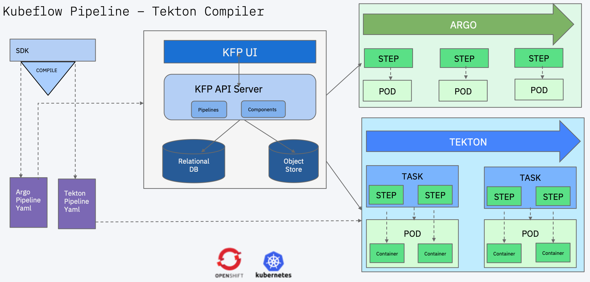

# Kubeflow Pipelines and Tekton
Experimental project to bring Kubeflow Pipelines and Tekton together. The work is being driven in accordance with this evolving [design doc specifications](http://bit.ly/kfp-tekton). Since this will evolve from experimental towards a more mature solution, we are keeping it currently separate from [Kubeflow Pipeline repo](https://github.com/kubeflow/pipelines)

## Tekton
The Tekton Pipelines project provides Kubernetes-style resources for declaring CI/CD-style pipelines. Tekton introduces several new CRDs including Task, Pipeline, TaskRun, and PipelineRun. A PipelineRun represents a single running instance of a Pipeline and is responsible for creating a Pod for each of its Tasks and as many containers within each Pod as it has Steps.  Some tasks here will invariably require contributions back to Tekton. Please follow the community guidelines in [Tekton repo](https://github.com/tektoncd/pipeline).

## Development: Kubeflow Pipeline DSL to Tekton Compiler

The work will be split in three phases. While the details of the phases are listed in the [design doc](http://bit.ly/kfp-tekton), the current effort in this repository is focussed on creating a Kubeflow Pipeline compiler for Tekton, which can take KFP DSL, and compile it to Tekton yaml. We will update the details as we move into other phases, in concurrence with design decisions.

To get started with contributing to KFP Tekton Compiler, please [follow these instructions](sdk/README.md), as well as look at [open issues on the repo](https://github.com/kubeflow/kfp-tekton/issues)

We are using Kubeflow Pipelines v0.2.2 and Tekton v0.11.3 for the project currently. You may also be interested in [KFP, Argo and Tekton Features Comparision](https://docs.google.com/spreadsheets/d/1LFUy86MhVrU2cRhXNsDU-OBzB4BlkT9C0ASD3hoXqpo/edit#gid=979402121) which the team has compiled, and it goes in fine-grained details.

## CD Foundation

The work here is being tracked under the [CD Foundation MLOps Sig](https://cd.foundation/blog/2020/02/11/announcing-the-cd-foundation-mlops-sig/). If you are interested in joining, please see the [instructions here](https://github.com/cdfoundation/sig-mlops)

## Additional Reference Materials: KFP and TFX
1. [Kubeflow Pipelines-TFX Pipelines](/samples/kfp-tfx)
2. [Kubeflow Pipelines-TFX Pipelines Talk at Tensorflow World](https://www.slideshare.net/AnimeshSingh/hybrid-cloud-kubeflow-and-tensorflow-extended-tfx)
3. [Kubeflow Pipelines-TFX Pipelines RFC](https://docs.google.com/document/d/1_n3q0mNOr7gUSM04yaA0e5BO9RrS0Vkh1cNCyrB07WM/edit)
