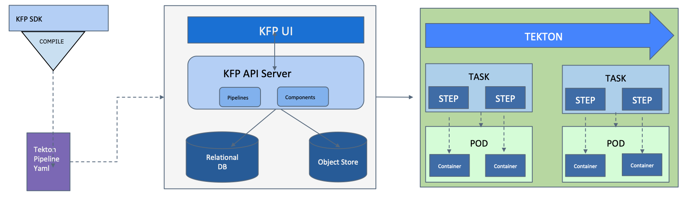

# Kubeflow Pipelines on Tekton

Project bringing Kubeflow Pipelines and Tekton together. The project is driven
according to this [design doc](http://bit.ly/kfp-tekton). The current code allows you run Kubeflow Pipelines with Tekton backend end to end.

* Create your Pipeline using Kubeflow Pipelines DSL, and compile it to Tekton
  YAML.
* Upload the compiled Tekton YAML to KFP engine (API and UI), and run end to end
  with logging and artifacts tracking enabled.

For more details about the project please follow this detailed [blog post](https://developer.ibm.com/blogs/kubeflow-pipelines-with-tekton-and-watson/). For latest information and supported offerings, please follow the [Kubeflow Pipelines on Tekton 1.0 release blog](https://developer.ibm.com/blogs/kubeflow-pipelines-and-tekton-advances-data-workloads/). Additionally, look at these [slides](https://www.slideshare.net/AnimeshSingh/kubeflow-pipelines-with-tekton-236769976) as well as this [deep dive presentation](https://www.youtube.com/watch?v=AYIeNtXLT_k) for demos.

**Note**: If you are interested in a sister project built on top of Kubeflow Pipelines with Tekton, please try [Machine Learning eXchange (MLX)](https://github.com/machine-learning-exchange), Data and AI Assets Catalog and Execution Engine. It introduces a 'Component Registry' for Kubeflow Pipelines, amongst other things.

## Architecture

We are currently using [Kubeflow Pipelines 1.8.4](https://github.com/kubeflow/pipelines/releases/tag/1.8.4) and
[Tekton >= 0.41.0](https://github.com/tektoncd/pipeline/releases/tag/v0.41.0)
for this project.

Kubeflow Pipelines is a platform for building and deploying portable, scalable machine learning (ML) workflows. More architectural details about the Kubeflow Pipelines can be found on the [Kubeflow website](https://www.kubeflow.org/docs/components/pipelines/overview/).

The Tekton Pipelines project provides Kubernetes-style resources for declaring
CI/CD-style pipelines. Tekton introduces several [Custom Resource Definitions](https://kubernetes.io/docs/concepts/extend-kubernetes/api-extension/custom-resources/)(CRDs) including Task, Pipeline, TaskRun, and PipelineRun. A PipelineRun represents a single running instance of a Pipeline and is responsible for creating a Pod for each of its Tasks and as many containers within each Pod as it has Steps. Please look for more details in the [Tekton repo](https://github.com/tektoncd/pipeline).

### Get Started using Kubeflow Pipelines on Tekton

[Install Kubeflow Pipelines with Tekton backend](/guides/kfp_tekton_install.md)

[KFP Tekton Pipelines User Guide](/guides/kfp-user-guide/README.md)

[Use KFP Tekton SDK](/sdk/README.md)

[Run Samples](/samples/README.md)

[Available KFP DSL Features](/sdk/FEATURES.md)

[Tekton Specific Features](/guides/advanced_user_guide.md)

### Development Guides

[Backend Developer Guide](/guides/developer_guide.md)

[SDK Developer Guide](/sdk/python/README.md)

[Compilation Tests Status Report](/sdk/python/tests/README.md)

### Design Guides

[Design Doc](http://bit.ly/kfp-tekton)

[KFP, Argo and Tekton Features Comparison](https://docs.google.com/spreadsheets/d/1LFUy86MhVrU2cRhXNsDU-OBzB4BlkT9C0ASD3hoXqpo/edit#gid=979402121)

### Community

[Kubeflow Slack](https://join.slack.com/t/kubeflow/shared_invite/zt-cpr020z4-PfcAue_2nw67~iIDy7maAQ)

[CD Foundation MLOps Sig](https://cd.foundation/blog/2020/02/11/announcing-the-cd-foundation-mlops-sig/).

[Instructions to join](https://github.com/cdfoundation/sig-mlops)

### References

[Kubeflow and TFX Pipelines](/samples/kfp-tfx)

[Kubeflow and TFX Pipelines talk at Tensorflow World](https://www.slideshare.net/AnimeshSingh/hybrid-cloud-kubeflow-and-tensorflow-extended-tfx)
