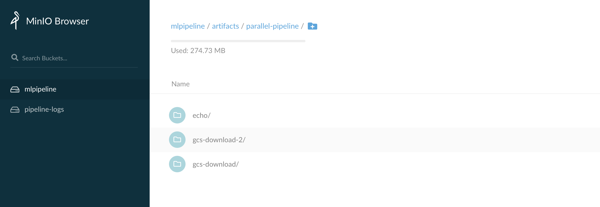
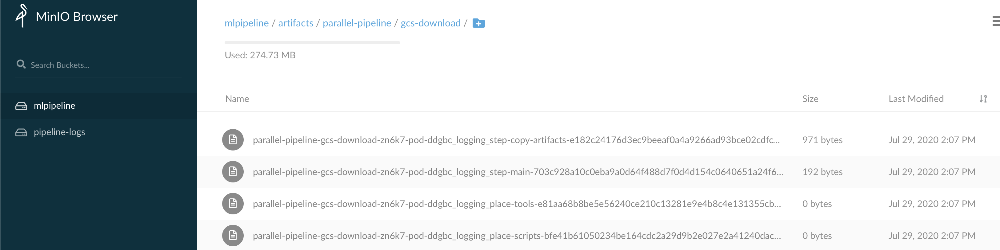

# Collect Tekton pipelinerun/taskrun logs to S3 storage via Tekton Compiler

## Deploy MinIO. In our case AWS S3 (tested through minio)

1. Create secret  for your S3 ACCESS_KEY_ID and SECRET_ACCESS_KEY (admin123):
```
ACCESS_KEY_ID=admin123
SECRET_ACCESS_KEY=admin123
kubectl -n logging create secret generic mlpipeline-minio-artifact --from-literal "accesskey=$ACCESS_KEY_ID" --from-literal "secretkey=$SECRET_ACCESS_KEY"
```

2. Create minio_standalon.yaml file with below content

```
kubectl -n logging apply -f - <<"EOF" 
apiVersion: apps/v1
kind: Deployment
metadata:
  name: minio-deployment
  namespace: logging
spec:
  selector:
    matchLabels:
      app: minio
  strategy:
    type: Recreate
  template:
    metadata:
      labels:
        app: minio
    spec:
      containers:
      - name: minio
        image: minio/minio
        args:
        - server
        - /storage
        readinessProbe:
          httpGet:
            path: /minio/health/ready
            port: 9000
          initialDelaySeconds: 10
          periodSeconds: 5
        env:
        - name: MINIO_REGION
          value: 'test_region'
        - name: MINIO_ACCESS_KEY
          valueFrom:
            secretKeyRef:
              name: mlpipeline-minio-artifact
              key: accesskey
        - name: MINIO_SECRET_KEY
          valueFrom:
            secretKeyRef:
              name: mlpipeline-minio-artifact
              key: secretkey
        ports:
        - containerPort: 9000
      volumes:
        - name: mlpipeline-minio-artifact
          secret:
            secretName: mlpipeline-minio-artifact
---
apiVersion: v1
kind: Service
metadata:
  name: minio-service
spec:
  type: NodePort
  ports:
    - port: 9000
      targetPort: 9000
      protocol: TCP
  selector:
    app: minio

EOF
```

3. Deploy minio via `kubectl apply -f minio_standalon.yaml -n logging`

4. Access minio service:
```
 kc get svc -n logging
NAME            TYPE       CLUSTER-IP      EXTERNAL-IP   PORT(S)          AGE
minio-service   NodePort   10.108.182.51   <none>        9000:31440/TCP   52m
```
Access minio GUI via: `http://<public_ip>:31440`

## Complier Tekton PipelineRun

1. Complier Tekton PipelineRun, Ensure `enable_s3_logs=True` was set, and Tekton complier SDK is installed.

```
Python parallel_join.py
```

2. Apply PipelineRun to k8s cluster.
```
kubectl -n logging apply -f 
```

## Check the logs in S3
You can get the logs from S3 web now, via `http://<public_ip>:31440`


