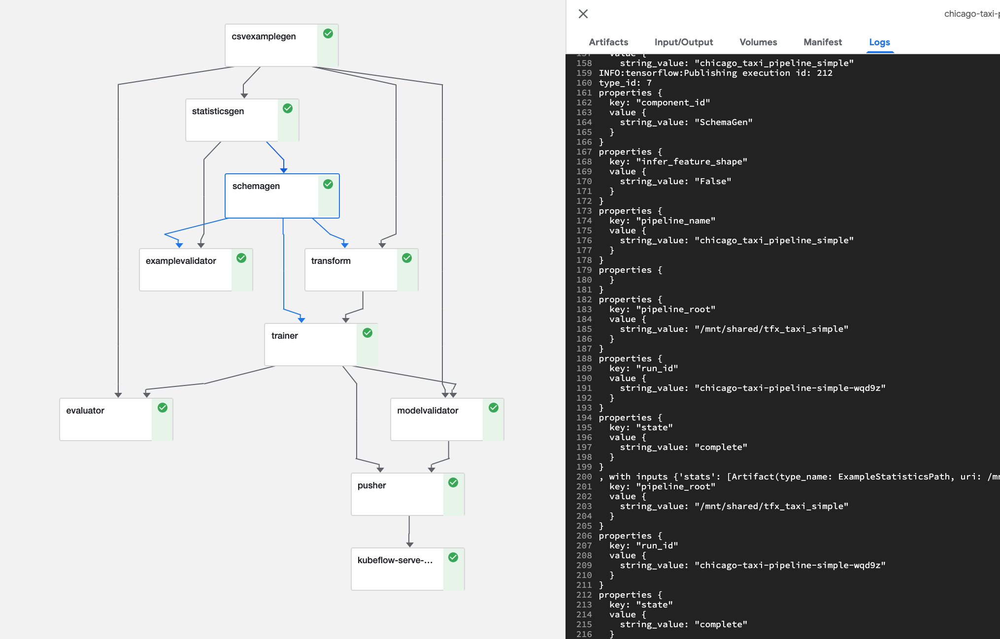

# TFX-KFP DSL and YAML example

This repository holds Chicago TFX Sample Pipeline DSL, and corresponding Argo yaml. In addition, uses KFP library modeule ('onprem') to make the TFX pipeline work in the context of on-prem cluster, using PVC instead of GCS.

Additionally, we have engineered the Argo yaml to push the trained TF model to KFServing to be deployed, using ContainerOp/

The goal of this sample is to show the importance of KFP constructs in context of TFX Pipeline DSL. 

