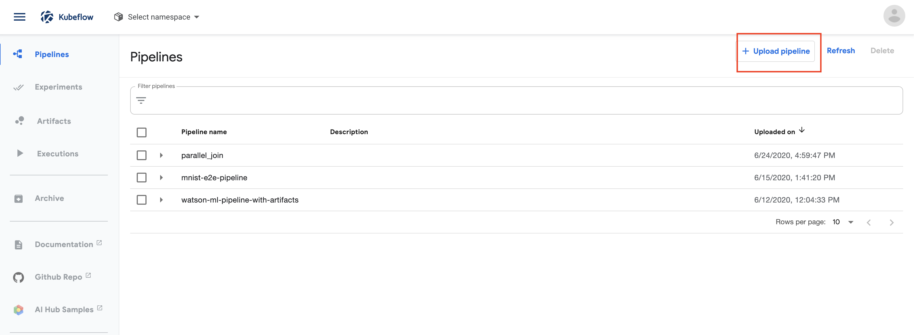
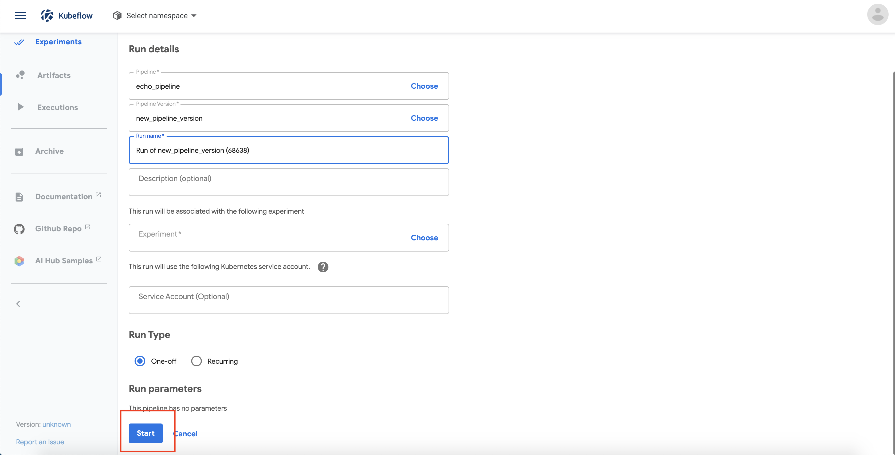

# Kubeflow pipeline user guide

This page introduces different ways to compile, upload, and execute Kubeflow Pipelines with Tekton backend. The usual flow for using the Kubeflow Pipeline is to compile the Kubeflow Pipeline Python DSL into a Tekton formatted file. Then upload the compiled file to the Kubeflow Pipeline platform. Lastly, execute the uploaded pipeline using the Kubeflow Pipeline backend engine. For starter, we recommend using the first method in each section.

In this tutorial, we use the below single step pipeline as our example
```python
from kfp import dsl
def echo_op():
    return dsl.ContainerOp(
        name='echo',
        image='busybox',
        command=['sh', '-c'],
        arguments=['echo "Got scheduled"']
    )

@dsl.pipeline(
    name='echo',
    description='echo pipeline'
)
def echo_pipeline(
):
    echo = echo_op()
```
## Table of Contents

  - [Pipeline compilation](#pipeline-compilation)
    - [1. Compile pipelines using the `kfp_tekton.compiler.TektonCompiler` in Python](#1-compile-pipelines-using-the-kfp_tektoncompilertektoncompiler-in-python)
    - [2. Compile pipelines using the `dsl-compile-tekton` bash command line tool](#2-compile-pipelines-using-the-dsl-compile-tekton-bash-command-line-tool)
  - [Uploading pipelines](#uploading-pipelines)
    - [1. Upload pipelines using the Kubeflow Pipeline user interface.](#1-upload-pipelines-using-the-kubeflow-pipeline-user-interface)
    - [2. Upload pipelines using the `kfp_tekton.TektonClient` in Python](#2-upload-pipelines-using-the-kfp_tektontektonclient-in-python)
    - [3. Upload pipelines using the `kfp` bash command line tool](#3-upload-pipelines-using-the-kfp-bash-command-line-tool)
  - [Pipeline execution](#pipeline-execution)
    - [1. Execute pipelines using the Kubeflow Pipeline user interface.](#1-execute-pipelines-using-the-kubeflow-pipeline-user-interface)
    - [2. Execute pipelines using the `kfp_tekton.TektonClient` in Python](#2-execute-pipelines-using-the-kfp_tektontektonclient-in-python)
    - [3. Execute pipelines using the `kfp` bash command line tool](#3-execute-pipelines-using-the-kfp-bash-command-line-tool)
    - [4. Tekton Exclusive: Execute Tekton pipelines without using Kubeflow pipeline](#4-tekton-exclusive-execute-tekton-pipelines-without-using-kubeflow-pipeline)

## Compile Pipelines

### 1. Compile pipelines using the `kfp_tekton.compiler.TektonCompiler` in Python
This is the recommended way to compile pipelines using Python. Here we will import the `TektonCompiler` class and use the `compile` function to compile the above `echo_pipeline` into a Tekton yaml called `echo_pipeline.yaml`. The output format can be renamed to one of the followings: `[.tar.gz, .tgz, .zip, .yaml, .yml]` 
```python
from kfp_tekton.compiler import TektonCompiler
TektonCompiler().compile(echo_pipeline, 'echo_pipeline.yaml')
```

In addition, we can put the above python code into a python `__main__` function. Then, the compilation can be done in terminal with a simple python command.
```shell
python echo_pipeline.py
```

### 2. Compile pipelines using the `dsl-compile-tekton` bash command line tool
The kfp-tekton SDK also comes with a bash command line tool for compiling Kubeflow pipelines. Here, we need to store the above `echo_pipeline` example into a python file called `echo_pipeline.py` and run the below bash command. The `--output` supports the following formats: `[.tar.gz, .tgz, .zip, .yaml, .yml]`
```shell
dsl-compile-tekton --py echo_pipeline.py  --output pipeline.yaml
```

## Upload Pipelines

### 1. Upload pipelines using the Kubeflow Pipeline user interface.
This is the recommended way to upload and manage pipeline using the Kubeflow pipeline web user interface. Go to the Kubeflow main dashboard(Endpoint of the istio-ingressgateway) and click on the **Pipelines** tab on the left panel. Then click on the **Upload pipeline button**.



Then, click on **Upload a file** and select our compiled pipeline file. Then click on **Upload** at the end to upload the pipeline.


Now, we should able to see the pipeline is being uploaded to the **Pipelines** page. 

### 2. Upload pipelines using the `kfp_tekton.TektonClient` in Python
To upload the pipelines using Python, run the below code block inside the Python session. The below code block shows how to upload different versions of the pipeline using the Python client.
```python
import kfp_tekton
import os

# **Important**: Replace None to the KFP endpoint if the python session is not running on the Kubeflow cluster.
host = None

# Initial version of the compiled pipeline
pipeline_file_path = 'echo_pipeline.yaml'
pipeline_name = 'echo_pipeline'

# For the purpose of this tutorial, we will be using the same pipeline for both version.
pipeline_version_file_path = 'echo_pipeline.yaml'
pipeline_version_name = 'new_echo_pipeline'

# Upload initial version of the pipeline
client = kfp_tekton.TektonClient(host)
pipeline_file = os.path.join(pipeline_file_path)
pipeline = client.pipeline_uploads.upload_pipeline(pipeline_file, name=pipeline_name)

# Upload new version of the pipeline
pipeline_version_file = os.path.join(pipeline_version_file_path)
pipeline_version = client.pipeline_uploads.upload_pipeline_version(pipeline_version_file,
                                                                   name=pipeline_version_name,
                                                                   pipelineid=pipeline.id)
```

### 3. Upload pipelines using the `kfp` bash command line tool
The kfp-tekton SDK also comes with a bash command line tool for uploading Kubeflow pipelines. Before running the below commands, we need to make sure our `kubectl` is connected to our Kubeflow cluster.
```shell
kubectl get pods -n kubeflow | grep ml-pipeline
# ml-pipeline-fc87669c7-f98x4                                      1/1     Running   0          8d
# ml-pipeline-ml-pipeline-visualizationserver-569c95464-k9qcx      1/1     Running   0          33d
# ml-pipeline-persistenceagent-bb9986b46-l4kcx                     1/1     Running   0          8d
# ml-pipeline-scheduledworkflow-b959d6fd-bnc2w                     1/1     Running   0          33d
# ml-pipeline-ui-6f68595ff-tw295                                   1/1     Running   0          8d
# ml-pipeline-viewer-controller-deployment-7f65754d48-xz6jh        1/1     Running   0          33d
# ml-pipeline-viewer-crd-7bb858bb59-k9mz9                          1/1     Running   0          33d
# ml-pipeline-visualizationserver-d558b855-tdbwc                   1/1     Running   0          33d
```

To upload a new pipeline
```shell
kfp pipeline upload -p echo_pipeline echo_pipeline.yaml
# Pipeline 925415d5-18e9-4e08-b57f-3b06e3e54648 has been submitted

# Pipeline Details
# ------------------
# ID           925415d5-18e9-4e08-b57f-3b06e3e54648
# Name         echo_pipeline
# Description
# Uploaded at  2020-07-02T17:55:30+00:00
```

To upload a new version of an existing pipeline
```shell
kfp pipeline upload-version -p <existing_pipeline_id> -v new_pipeline_version echo_pipeline.yaml
# The new_pipeline_version version of the pipeline 925415d5-18e9-4e08-b57f-3b06e3e54648 has been submitted

# Pipeline Version Details
# --------------------------
# Pipeline ID   925415d5-18e9-4e08-b57f-3b06e3e54648
# Version Name  new_pipeline_version
# Uploaded at   2020-07-02T17:58:05+00:00
```

## Execute Pipelines

### 1. Execute pipelines using the Kubeflow Pipeline user interface.
Once we have the pipeline uploaded, we can simply execute the pipeline by clicking on the pipeline name. Then click **Create run** on the pipeline page. 


Next, click **Start** to execute the pipeline.



Now, the pipeline is executing and we can click on the pipeline run to view the execution graph.


### 2. Execute pipelines using the `kfp_tekton.TektonClient` in Python
The TektonClient can execute pipelines using one of the below sources: 
1. Python DSL source code
2. Compiled pipeline file.
3. List of uploaded pipelines

To execute pipelines using the Python DSL source code, run the below code block in a Python session using the `echo_pipeline` example.
The `create_run_from_pipeline_func` takes the DSL source code to compile and run it directly using the Kubeflow pipeline API without
uploading it to the pipeline list. This method is recommended if we are doing some quick experiments without version control.

```python
# **Important**: Replace None to the KFP endpoint if the python session is not running on the Kubeflow cluster.
host = None

# We can overwrite the pipeline default parameters by providing a dictionary of key-value arguments.
# If we don't want to overwrite the default parameters, then define the arguments as an empty dictionary.
arguments={}

from kfp_tekton import TektonClient
TektonClient(host=host).create_run_from_pipeline_func(echo_pipeline, arguments=arguments)
```

Alternatively, we can also run the pipeline directly using a pre-compiled file. 
```python
from kfp_tekton import TektonClient
# **Important**: Replace None to the KFP endpoint if the python session is not running on the Kubeflow cluster.
host = None
client = TektonClient(host=host)

EXPERIMENT_NAME = 'Demo Experiments'
experiment = client.create_experiment(name=EXPERIMENT_NAME)
run = client.run_pipeline(experiment.id, 'echo-pipeline', 'echo_pipeline.yaml')
``` 

Similarly, we can also run the pipeline from the list of uploaded pipelines using the same `run_pipeline` function. 

```python
from kfp_tekton import TektonClient
# **Important**: Replace None to the KFP endpoint if the python session is not running on the Kubeflow cluster.
host = None
client = TektonClient(host=host)

EXPERIMENT_NAME = 'Demo Experiments'
experiment = client.create_experiment(name=EXPERIMENT_NAME)

# Find the pipeline ID that we want to use.
client.list_pipelines()

run = client.run_pipeline(experiment.id, pipeline_id='925415d5-18e9-4e08-b57f-3b06e3e54648', job_name='echo_pipeline_run')
``` 

### 3. Execute pipelines using the `kfp` bash command line tool
The kfp-tekton SDK also comes with a bash command line tool for running Kubeflow pipelines. Before running the below commands, we need to make sure our `kubectl` is connected to our Kubeflow cluster.
```shell
kubectl get pods -n kubeflow | grep ml-pipeline
# ml-pipeline-fc87669c7-f98x4                                      1/1     Running   0          8d
# ml-pipeline-ml-pipeline-visualizationserver-569c95464-k9qcx      1/1     Running   0          33d
# ml-pipeline-persistenceagent-bb9986b46-l4kcx                     1/1     Running   0          8d
# ml-pipeline-scheduledworkflow-b959d6fd-bnc2w                     1/1     Running   0          33d
# ml-pipeline-ui-6f68595ff-tw295                                   1/1     Running   0          8d
# ml-pipeline-viewer-controller-deployment-7f65754d48-xz6jh        1/1     Running   0          33d
# ml-pipeline-viewer-crd-7bb858bb59-k9mz9                          1/1     Running   0          33d
# ml-pipeline-visualizationserver-d558b855-tdbwc                   1/1     Running   0          33d
```

Then, we need to find the pipeline ID that we want to execute.
```shell
kfp pipeline list
# +--------------------------------------+-----------------------------------+---------------------------+
# | Pipeline ID                          | Name                              | Uploaded at               |
# +======================================+===================================+===========================+
# | 925415d5-18e9-4e08-b57f-3b06e3e54648 | echo_pipeline                     | 2020-07-02T17:55:30+00:00 |
# +--------------------------------------+-----------------------------------+---------------------------+
```

Next, submit the pipeline ID for execution
```shell
kfp run submit kfp run submit -e experiment-name -r run-name -p 925415d5-18e9-4e08-b57f-3b06e3e54648
# Creating experiment experiment-name.
# Run bb96363f-ec0d-4e5a-9ce9-f69a485c2d94 is submitted
# +--------------------------------------+----------+----------+---------------------------+
# | run id                               | name     | status   | created at                |
# +======================================+==========+==========+===========================+
# | bb96363f-ec0d-4e5a-9ce9-f69a485c2d94 | run-name |          | 2020-07-02T19:08:58+00:00 |
# +--------------------------------------+----------+----------+---------------------------+
```

Lastly, we can check the status of the pipeline execution
```shell
kfp run get bb96363f-ec0d-4e5a-9ce9-f69a485c2d94
# +--------------------------------------+----------+-----------+---------------------------+
# | run id                               | name     | status    | created at                |
# +======================================+==========+===========+===========================+
# | bb96363f-ec0d-4e5a-9ce9-f69a485c2d94 | run-name | Succeeded | 2020-07-02T19:08:58+00:00 |
# +--------------------------------------+----------+-----------+---------------------------+
```


### 4. Optional: Execute Tekton pipelines without using Kubeflow Pipelines engine
For all the compiled Kubeflow pipelines, we can extract them into `.yaml` format and run them directly on Kubernetes using the Tekton CRD. However, this method should **only use for Tekton development** because Kubeflow Pipelines engine cannot track these pipelines that run directly on Tekton.

Assuming the `kubectl` is connected to a Kubernetes cluster with Tekton, we can simply run the apply command to run the Tekton pipeline.

```shell
kubectl apply -f echo_pipeline.yaml
```

Then we can view the status using the `kubectl describe` command.

```shell
kubectl describe pipelinerun echo
# Name:         echo
# Namespace:    default
# ...
# Events:
#   Type     Reason             Age                      From                 Message
#   ----     ------             ----                     ----                 -------
#   Warning  PipelineRunFailed  2s                       pipeline-controller  PipelineRun failed to update labels/annotations
#   Normal   Running            <invalid> (x11 over 2s)  pipeline-controller  Tasks Completed: 0, Incomplete: 1, Skipped: 0
#   Normal   Succeeded          <invalid>                pipeline-controller  Tasks Completed: 1, Skipped: 0
```
