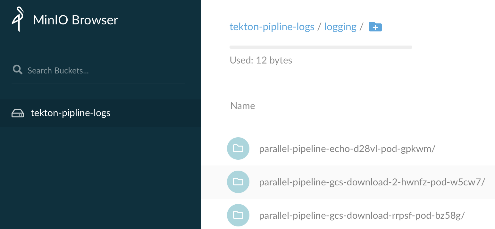

# Collect Tekton pipelinerun/taskrun logs to S3 storage

## Deploy MinIO

1. Create secret  for your S3 ACCESS_KEY_ID and SECRET_ACCESS_KEY (admin123):
```
ACCESS_KEY_ID=admin123
SECRET_ACCESS_KEY=admin123
kubectl create ns logging
kubectl -n logging create secret generic logging-s3 --from-literal "accesskey=$ACCESS_KEY_ID" --from-literal "secretkey=$SECRET_ACCESS_KEY"
```

2. Create minio_standalon.yaml file with below content

```
kubectl -n logging apply -f - <<"EOF" 
apiVersion: apps/v1
kind: Deployment
metadata:
  name: minio-deployment
  namespace: logging
spec:
  selector:
    matchLabels:
      app: minio
  strategy:
    type: Recreate
  template:
    metadata:
      labels:
        app: minio
    spec:
      containers:
      - name: minio
        image: minio/minio
        args:
        - server
        - /storage
        readinessProbe:
          httpGet:
            path: /minio/health/ready
            port: 9000
          initialDelaySeconds: 10
          periodSeconds: 5
        env:
        - name: MINIO_REGION
          value: 'test_region'
        - name: MINIO_ACCESS_KEY
          valueFrom:
            secretKeyRef:
              name: logging-s3
              key: accesskey
        - name: MINIO_SECRET_KEY
          valueFrom:
            secretKeyRef:
              name: logging-s3
              key: secretkey
        ports:
        - containerPort: 9000
      volumes:
        - name: logging-s3
          secret:
            secretName: logging-s3
---
apiVersion: v1
kind: Service
metadata:
  name: minio-service
spec:
  type: NodePort
  ports:
    - port: 9000
      targetPort: 9000
      protocol: TCP
  selector:
    app: minio

EOF
```

3. Access minio service:
```
 kc get svc -n logging
NAME            TYPE       CLUSTER-IP      EXTERNAL-IP   PORT(S)          AGE
minio-service   NodePort   10.108.182.51   <none>        9000:31440/TCP   52m
```
Access minio GUI via: `http://<public_ip>:31440`

## Deploy banzaicloud logging operator

Deploy the logging operator by running the following commands:
```
kubectl -n logging create -f https://raw.githubusercontent.com/banzaicloud/logging-operator/master/docs/deploy/manifests/rbac.yaml
kubectl -n logging create -f https://raw.githubusercontent.com/banzaicloud/logging-operator/master/config/crd/bases/logging.banzaicloud.io_clusterflows.yaml
kubectl -n logging create -f https://raw.githubusercontent.com/banzaicloud/logging-operator/master/config/crd/bases/logging.banzaicloud.io_clusteroutputs.yaml
kubectl -n logging create -f https://raw.githubusercontent.com/banzaicloud/logging-operator/master/config/crd/bases/logging.banzaicloud.io_flows.yaml
kubectl -n logging create -f https://raw.githubusercontent.com/banzaicloud/logging-operator/master/config/crd/bases/logging.banzaicloud.io_loggings.yaml
kubectl -n logging create -f https://raw.githubusercontent.com/banzaicloud/logging-operator/master/config/crd/bases/logging.banzaicloud.io_outputs.yaml
kubectl -n logging create -f https://raw.githubusercontent.com/banzaicloud/logging-operator/master/docs/deploy/manifests/deployment.yaml

```

## Collect the pipeline logs to S3

- Logging will deploy the necessary fluentd/fluentbit workloads:
```
cat <<EOF | kubectl -n logging apply -f -
apiVersion: logging.banzaicloud.io/v1beta1
kind: Logging
metadata:
  name: logging
spec:
  fluentd:
    logLevel: debug
  fluentbit: {}
  controlNamespace: logging
EOF
```

- ClusterOutput defines the output of the logs pipeline. In our case AWS S3 (through minio):

```
cat <<EOF | kubectl -n logging apply -f -
apiVersion: logging.banzaicloud.io/v1beta1
kind: ClusterOutput
metadata:
  name: s3
spec:
  s3:
    aws_key_id:
      valueFrom:
        secretKeyRef:
          key: accesskey
          name: logging-s3
    aws_sec_key:
      valueFrom:
        secretKeyRef:
          key: secretkey
          name: logging-s3
    s3_endpoint: http://<your_public_ip>:31440
    s3_bucket: tekton-pipline-logs
    s3_region: test_region
    force_path_style: 'true'
    store_as: text
    path: \${\$.kubernetes.namespace_name}/\${\$.kubernetes.pod_name}/\${\$.kubernetes.container_name}/
    s3_object_key_format: '%{path}%{time_slice}_%{index}.log'
    buffer:
      tags: time,\$.kubernetes.namespace_name,\$.kubernetes.pod_name,\$.kubernetes.container_name
      timekey: 1m
      timekey_wait: 1m
      timekey_use_utc: true
    format:
      type: single_value
      message_key: message
EOF
```

The `ClusterOutput` above will stream logs to our minio storage in a tekton-logs bucket. It will buffer logs and will store one file per minute in the <namespace_name>/<pod_name>/<container_name>/ path. All metadata will be ommited and only the log message will be stored, it will be the raw pod logs.

- ClusterFlow defines how the collected logs are dispatched to the outputs:

```
cat <<EOF | kubectl -n logging apply -f -
apiVersion: logging.banzaicloud.io/v1beta1
kind: ClusterFlow
metadata:
  name: flow
spec:
  outputRefs:
    - s3
  selectors:
    app.kubernetes.io/managed-by: tekton-pipelines
EOF
```

The ClusterFlow above takes all logs from pods that have the app.kubernetes.io/managed-by: tekton-pipelines label (those are the pods baking TaskRuns) and dispatches them to the ClusterOutput created in the previous step.


## Submit a tekton pipelinerun for testing

Running the PipelineRun should produce logs and you should see corresponding objects being added in minio as far as logs get collected and stored by the logs pipeline.
e.g. [parallel_join.yaml](/sdk/python/tests/compiler/testdata/parallel_join.yaml)

```
kubectl apply -f https://raw.githubusercontent.com/kubeflow/kfp-tekton/master/sdk/python/tests/compiler/testdata/parallel_join.yaml
```

## Access to S3 Web
You can get the logs from S3 web now, via `http://<public_ip>:31440`

