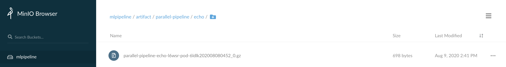

pipeline-logs-s3
===

Collect Tekton pipeline logs to S3, via Fluentd in a DaemonSet.

> Advantage:
> 1. Lightweight: only an 64.7MB docker image is used.
> 2. server-side-enable: security controlled by RBAC from server side.
> 3. Easy to use: user just need to provide your S3 info, and apply yaml file to your cluster, then everything is OK.

## How to use it

### 1. Create secret for your S3 ACCESS_KEY_ID and SECRET_ACCESS_KEY (admin123):
```
ACCESS_KEY_ID=admin123
SECRET_ACCESS_KEY=admin123
kubectl -n kube-system create secret generic pipeline-logs-s3-secret --from-literal "accesskey=$ACCESS_KEY_ID" --from-literal "secretkey=$SECRET_ACCESS_KEY"
```
### 2. Create configMap for S3 related info:

```
kubectl apply -f - <<EOF
apiVersion: v1
kind: ConfigMap
metadata:
  name: pipeline-logs-s3-config
  namespace: kube-system
data:
  S3_BUCKET: mlpipeline
  S3_REGION: test_region
  FORCE_PATH_STYLE: "true"
  S3_ENDPOINT: 'http://9.21.53.162:31846'

EOF
```


> Notes:
>
> S3_BUCKET: s3_bucket name, e.g. mlpipeline
>
> S3_REGION: s3_region, e.g. us-east-1 or test_region
>
> FORCE_PATH_STYLE: This prevents AWS SDK from breaking endpoint URL, set true if you are using minio
>
> S3_ENDPOINT: s3_endpoint, if you are using minio. e.g. http://9.21.53.162:31846


### 3. Collect the pipeline logs to S3
```
make deploy
```

## Demo The Result
The container logs will be archived to S3 as below picture





## Build your image (Optional)

Change the name of docker image in "Makefile", build your docker image:
```
make build
```

## Uninstall/Stop collecting the logs (Optional)

```
kubectl delete -f https://raw.githubusercontent.com/kubeflow/kfp-tekton/master/samples/logging_s3/pipeline_log_to_s3_by_fluentd_recommend/pipeline-logs-fluentd-s3.yaml
```

## Reference
Refer to [fenglixa/pipeline-logs-s3](https://github.com/fenglixa/pipeline-logs-s3)
