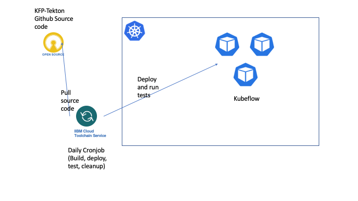

# IBM Cloud Toolchain for [kfp-tekton](https://github.com/kubeflow/kfp-tekton)

We use the "Develop a Kubernetes app" [toolchain](https://www.ibm.com/cloud/architecture/tutorials/use-develop-kubernetes-app-toolchain?task=2) to enable CI/CD testing for kfp-tekton.



The toolchain is bound to an IBM Cloud Kubernetes Service (IKS) cluster and runs the following in a *delivery pipeline*:

1. Pull the latest commit from github
2. Run unit tests
3. Build docker images and push to IBM Cloud Registry
3. Deploy tekton and kfp-tekton to IKS
4. Run e2e tests (submit a pipeline, check endpoints, etc)
5. Remove tekton and kfp-tekton

## Custom Docker Image
In order to build, test, deploy, etc... within the pipeline, we use a `Custom Docker Image` to package all the requisite build and runtime dependencies. The pipeline takes as input the [Dockerfile](./Dockerfile), which contains:
- Node.js
- Go
- kubectl
- kustomize
- helm2
- heml3
- jq
- ibmcloud

Run the following command to build the image:
```
docker build -t pipeline-base-image -f Dockerfile .
```

Or you can build and push the image to ibm cloud container registry:
```
ibmcloud cr build -f Dockerfile --tag <registry_url>/<namespace>/pipeline-base-image:<image tag> .
```
Replace the `registry url`, `namespace`, `image tag`, and even the `image name` as needed.

**Note:**
You can also use docker arguments to specify the version of `Node.js`, `Go`, `kubectl`, `heml2`, `heml3`, etc. Check the `ARG` in Dockerfile to see the details.

## Scripts

When running jobs in a pipeline, you can `source` an external shell script. For example:
```
source <(curl -sSL "https://raw.githubusercontent.com/yhwang/kfp-tekton-toolchain/main/scripts/run-test.sh")
```

The following scripts are used within the pipeline:
- `run-test.sh`
  - Runs `kfp-tekton`'s unit tests.
- `build-image.sh`
  - Cleans up kfp-tekton docker images in the container registry and builds the kfp-tekton docker images: `api-server`, `persistenceagent`, `metadata-writer`, and `scheduledworkflow`.
  - The environment variables `DOCKER_FILE`, `DOCKER_ROOT`, `IMAGE_NAME` must be specified properly. For example, use `DOCKER_FILE=backend/Dockerfile` and `IMAGE_NAME=api-server` to build the `api-server` image. It also needs some variables from `run-test.sh` script. The
  script only builds one image according to the `DOCKER_FILE` and `IMAGE_NAME` specified. In order to build all the images, you need to create multiple jobs and assign different
  values for those environment variables.
- `deploy-tekton.sh`
  - Deploys `tekton` to the cluster.
- `deploy-kfp-tekton.sh`
  - Creates the `kubeflow` namespace and deploys `kfp-tekton` to the cluster.
- `e2e.sh`
  - Runs an "end-to-end" test. The `flip coin` pipeline is used. The pipeline is uploaded to kubeflow, executed, and checked for a passing result.
- `undeploy-kubeflow.sh`
  - Deletes the kubeflow deployment and cleans up any related resources.
- `undeploy-tekton.sh`
  - Deletes the tekton deployment and cleans up any related resources.

These scripts store variables into ${ARCHIVE_DIR}/build.properties which could be used
by the subsequent jobs in the next stage. You need to specify `build.properties` as a
property file in the `Environment properties` tab.

## Status

WIP-

The toolchain is bound to XXX cluster.

The toolchain executes every XXX.

The toolchain outputs job updates to [this](https://ibm-cloudplatform.slack.com/archives/G01LD87L81Z) slack channel.

